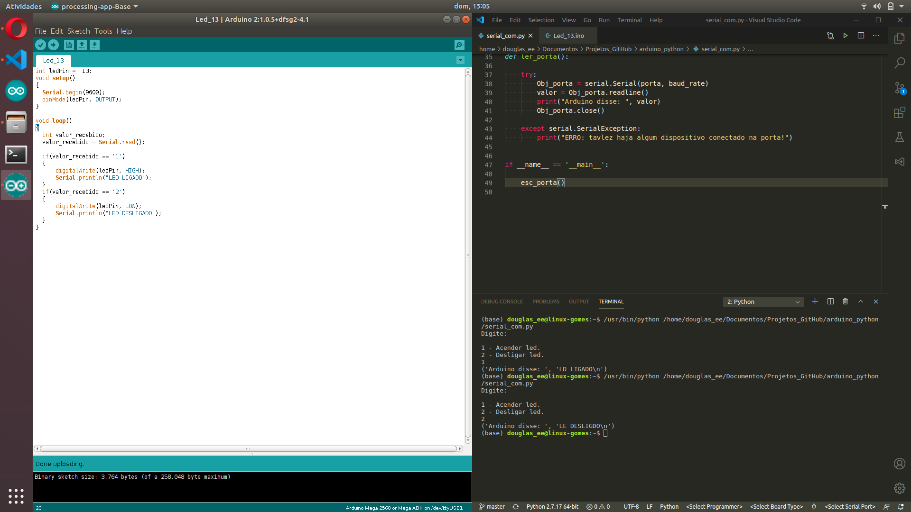
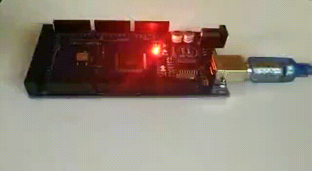

# Led_13

## Comunicação python com arduino:

### Procedimentos:

- Através de um códico python conseguimos nos comunicar via serial e acender um LED no arduino.
- Compile o codigo `.ino` na IDE do aduino e envie para a placa.
- Abra o codigo `.py` e indique qual porta será usada, e compile.

## Demonstração visual:

### Imagem:

**Figura: Programas**

### Video:

**Video: Placa acendendo o Led13**
